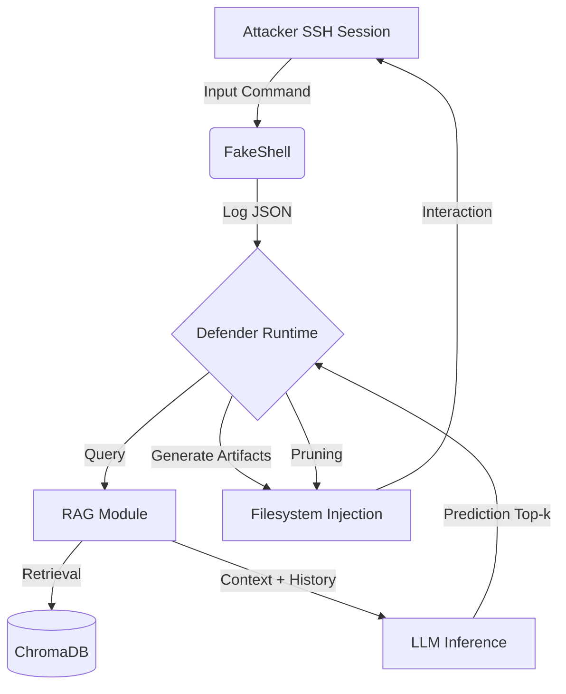

# Predictive Deception: LLM-based Command Anticipation in SSH Honeypots


Questo repository contiene l'implementazione ufficiale del framework **Predictive Deception**, un'architettura di sicurezza offensiva sviluppata nell'ambito del corso di Ingegneria Informatica dell'Università di Bologna.

Il progetto introduce un cambio di paradigma nella gestione degli honeypot SSH: dal logging passivo (reattivo) all'anticipazione comportamentale (proattiva), sfruttando **Large Language Models (LLM)** e **Retrieval-Augmented Generation (RAG)**.

---

## 📑 Indice

1. [Abstract](#abstract)
2. [Core Concept](#core-concept)
3. [Architettura del Sistema](#architettura-del-sistema)
4. [Struttura del Repository](#struttura-del-repository)
5. [Setup e Installazione](#setup-e-installazione)
6. [Workflow Operativo](#workflow-operativo)
7. [Autori](#autori)

---

##  Abstract

Gli honeypot tradizionali (es. Cowrie) raccolgono intelligence registrando le azioni degli attaccanti *post-factum*. Questo approccio limita le capacità di inganno (deception) in tempo reale.
**Predictive Deception** supera questo limite implementando un ciclo OODA (Observe-Orient-Decide-Act) automatizzato:
1.  **Observe:** Intercetta lo stream di comandi in tempo reale.
2.  **Orient:** Recupera contesti storici simili da un database vettoriale (RAG).
3.  **Decide:** Predice la sequenza di prossimi comandi ($Top\text{-}k$) tramite LLM.
4.  **Act:** Genera e materializza artefatti "esca" (file, log, config) nel filesystem prima che l'attaccante li richieda.
---

## Core Concept
Il cuore del progetto è la transizione da una difesa passiva a una **difesa proattiva e adattiva**.

Gli honeypot tradizionali (es. Cowrie) si limitano a registrare i comandi dopo che sono stati eseguiti e spesso presentano un ambiente statico facilmente identificabile. Il nostro sistema di **Predictive Deception** inverte questo approccio:

1.  **Anticipazione in Tempo Reale:** Un modulo predittivo basato su LLM analizza la sequenza di comandi dell'attaccante mentre la sessione è in corso.
2.  **Memoria Storica (RAG):** Utilizzando la *Retrieval-Augmented Generation*, il modello consulta un database vettoriale (ChromaDB) contenente migliaia di sessioni di attacco reali (dataset CyberLab Honeynet) per migliorare la precisione della predizione.
3.  **Generazione Dinamica di Artefatti:** Prima ancora che l'attaccante prema invio sul prossimo comando, il sistema "immagina" cosa potrebbe chiedere (es. un file di configurazione, una password, una directory specifica) e **crea l'artefatto ingannevole nel filesystem reale**.
4.  **Coerenza Temporale:** Se l'attaccante interagisce con l'artefatto, questo rimane persistente; se la predizione era errata o il percorso cambia, il sistema ripulisce le "false piste" per mantenere l'ambiente coerente e credibile.
---

##  Architettura del Sistema

Il sistema opera all'interno di un ambiente virtualizzato (Vagrant) isolato, orchestrato via Ansible.

### Diagramma Logico



### Struttura del Repository
```bash
Predictive_deception/
│
├── chroma_storage/                     # Database vettoriale ChromaDB
│   ├── chroma.sqlite3
│   └── DB_checkpoint.txt
│
├── Honeypot/                           # Ambiente honeypot (Vagrant + Ansible)
│   ├── Vagrantfile
│   ├── playbook.yml
│   ├── readme.txt
│   └── roles/
│       ├── db_vettoriale/
│       │   └── tasks/
│       ├── defender/
│       │   ├── files/
│       │   │   └── defender.py
│       │   ├── tasks/
│       │   └── vars/
│       ├── env_python/
│       │   ├── tasks/
│       │   └── vars/
│       └── fakeshell/
│           ├── files/
│           │   ├── fakeshell.py
│           │   └── fakeshell_easy.py
│           ├── handlers/
│           └── tasks/
│
├── inspectDataset/                     # Analisi e pulizia dataset Cowrie
│   ├── analyze_and_clean.py
│   ├── download_zenodo.py
│   └── merge_cowrie_datasets.py
│
├── prompting/                          # Motore predittivo LLM
│   ├── core_rag.py
│   ├── core_topk.py
│   ├── evaluate_gemini_rag.py
│   ├── evaluate_gemini_topk.py
│   ├── evaluate_ollama_rag.py
│   ├── evaluate_ollama_topk.py
│   └── utils.py
│
├── requirements.txt
├── .gitignore
└── README.md
```

## Workflow Operativo

| Step | Script / File                                                | Descrizione |
|------|--------------------------------------------------------------|-------------|
| 1️⃣  | `inspectDataset/download_zenodo.py`                          | Scarica automaticamente i dataset Cowrie da Zenodo e li salva nella cartella `data/` per l’analisi successiva. |
| 2️⃣  | `inspectDataset/analyze_and_clean.py`                        | Analizza i log Cowrie, normalizza i comandi, rimuove rumore/duplicati e genera versioni RAW/CLEAN in formato JSONL con statistiche. |
| 3️⃣  | `inspectDataset/merge_cowrie_datasets.py`                    | Unisce più file puliti in un unico dataset e produce lo split train/test (es. `cowrie_TRAIN.jsonl`, `cowrie_TEST.jsonl`) per gli esperimenti. |
| 4️⃣  | `prompting/core_rag.py`                                      | Implementa il motore RAG: crea/usa il database vettoriale in `chroma_storage/` e fornisce funzioni di retrieval contestuale per le predizioni. |
| 5️⃣  | `prompting/core_topk.py`                                     | Fornisce la logica generica di predizione Top-k (senza RAG), riutilizzabile da Gemini e modelli locali. |
| 6️⃣  | `prompting/evaluate_gemini_topk.py`                          | Valuta il modello Gemini in modalità Top-k pura, calcolando accuratezza Top-1/Top-5 sulle sessioni di test. |
| 7️⃣  | `prompting/evaluate_gemini_rag.py`                           | Valuta Gemini integrato con RAG (ChromaDB), usando contesto + retrieval per migliorare la predizione del prossimo comando. |
| 8️⃣  | `prompting/evaluate_ollama_topk.py`                          | Esegue test su modelli locali (es. CodeLlama via Ollama) in modalità Top-k senza RAG, per confrontarli con Gemini. |
| 9️⃣  | `prompting/evaluate_ollama_rag.py`                           | Valuta modelli locali integrati con RAG, combinando vector search + LLM per la next-command prediction. |
| 🔟  | `Honeypot/Vagrantfile` + `Honeypot/playbook.yml`              | Definisce e configura l’ambiente honeypot tramite Vagrant + Ansible (VM, utenti, Python, log, ruoli Ansible, ecc.). |
| 1️⃣1️⃣ | `Honeypot/roles/fakeshell/files/fakeshell.py`             | Implementa una fake shell avanzata nella VM: prompt realistico, esecuzione comandi e logging di ogni comando in `/var/log/fakeshell.json`. |
| 1️⃣2️⃣ | `Honeypot/roles/defender/files/defender.py`                 | Versione deployabile del Defender: segue il log della fake shell, usa RAG+Gemini per predire i prossimi comandi e crea artefatti di deception nel filesystem della VM. |

## Autori

| | | |
|:--:|:--:|:--:|
| <a href="https://github.com/BlackRaffo70"></a> | <a href="https://github.com/melomatte"></a> | <a href="https://github.com/kikeeeee"></a> |
| **Raffaele Neri**<br/>[@BlackRaffo70](https://github.com/BlackRaffo70) | **Matteo Melotti**<br/>[@melottimatteo](https://github.com/melomatte) | **Enrico Borsetti**<br/>[@enricoborsetti](https://github.com/kikeeeee) |

---

📘 *Progetto di ricerca:*  
**🍯 Predictive Deception – LLM-based Command Anticipation in SSH Honeypots**  
Università di Bologna – Corso di Laurea Magistrale in Ingegneria Informatica  

👨‍🏫 *Docente referente:* **Prof. Michele Colajanni**
